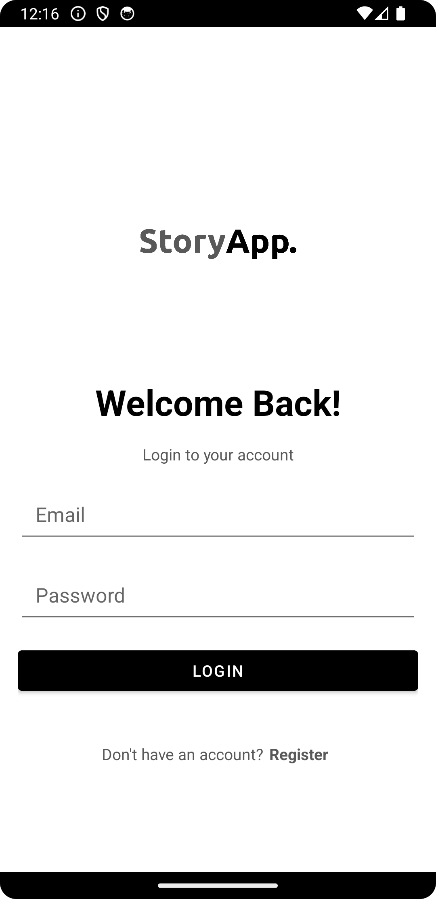
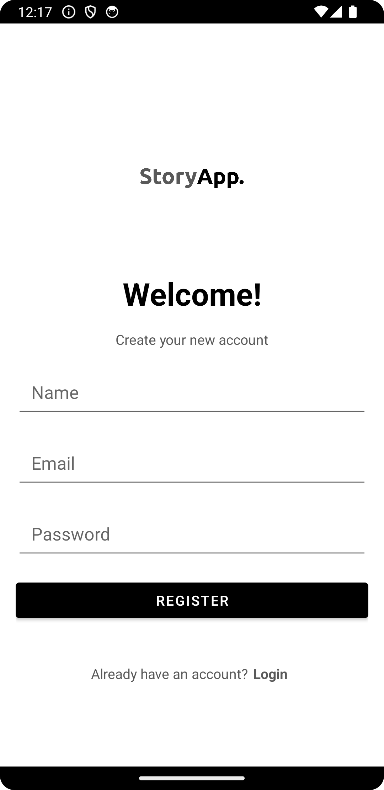
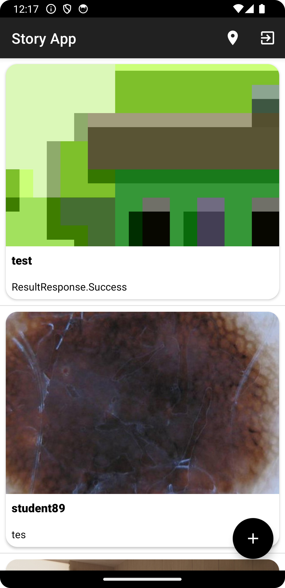
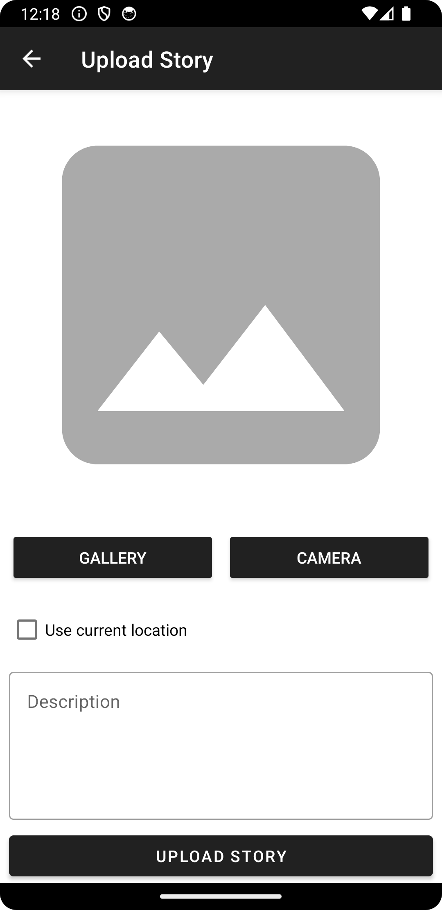
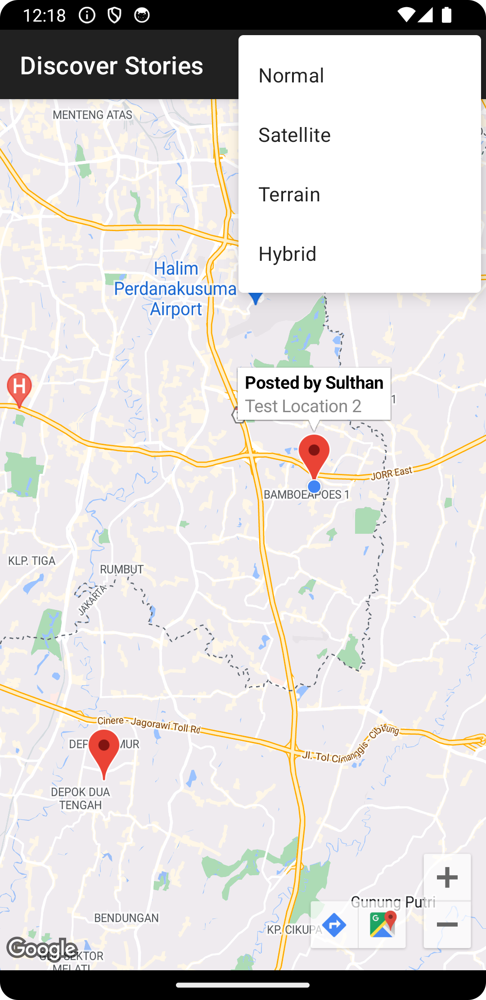
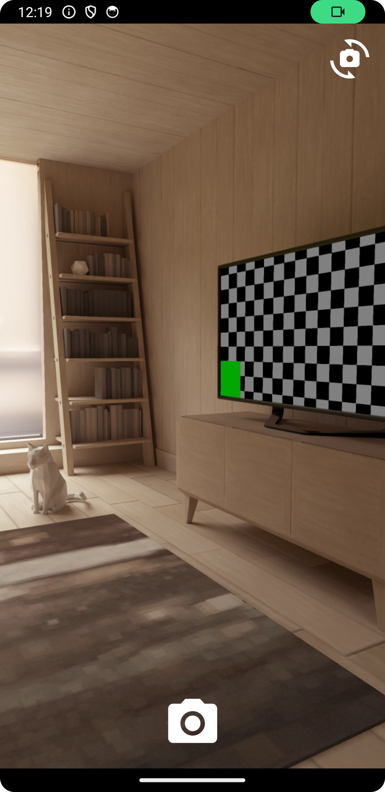
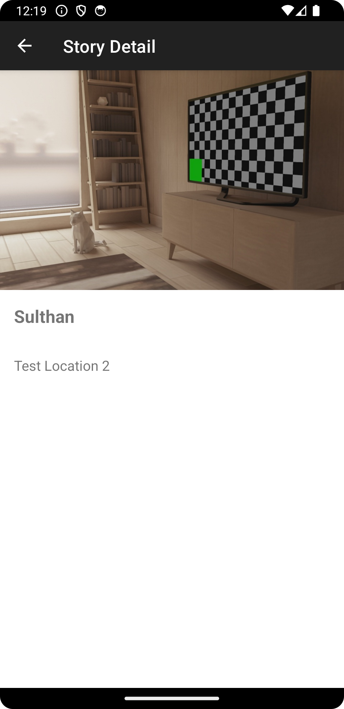

# Story Application

## Description

The Story Application is an Android app developed as the culminating project for the "Belajar Pengembangan Aplikasi Android Intermediate" course by Dicoding. Built with Kotlin, it enables users to log in and view stories from all users of the Story Application. Additionally, it allows users to upload their own stories using either the gallery or CameraX.

**Note** : For learning purposes, not for plagiarism, following Dicoding's rules.

## Features
- **Authentication**: Allows users to create an account (sign up), log in to the app, and log out. This ensures that only authenticated users can access certain features of the application.
- **Discover Stories**: Users can browse through a collection of stories uploaded by other users. This feature enables users to see the diverse stories shared by the community.
- **Upload Story**: Users can upload their own stories either by selecting an image from the gallery or by using the CameraX feature to take a new photo. Additionally, users can add their current location to the story.
- **Story Detail**: Users can view the details of a specific story, including the story's location integrated with Google Maps, allowing them to see where the story was posted from.

## Preview Application
| Login | Signup | Home |
| --- | --- | --- |
|  |  |  |

| Upload | Map | Camera |
| --- | --- | --- |
|  |  |  |

| Story Detail |
| --- |
|  |